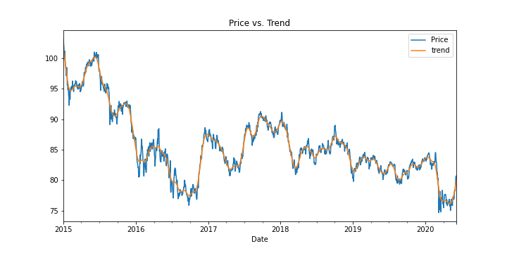
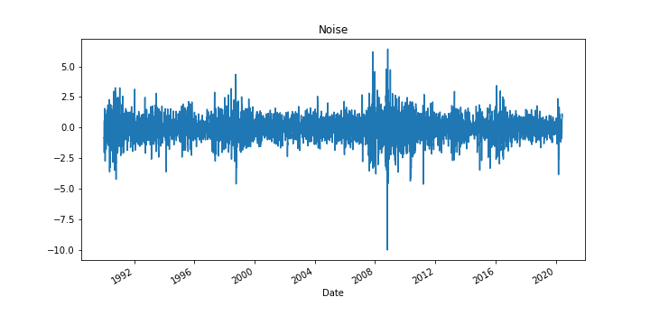
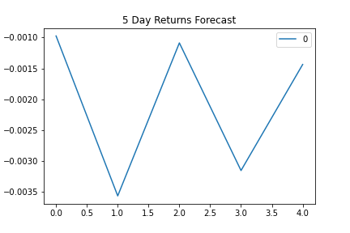
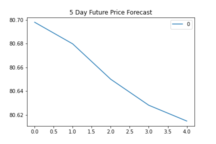
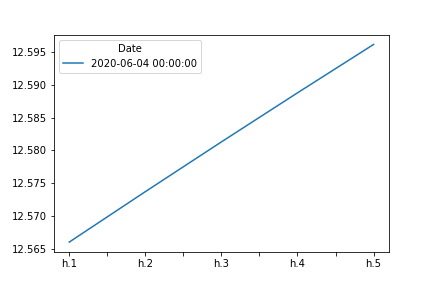
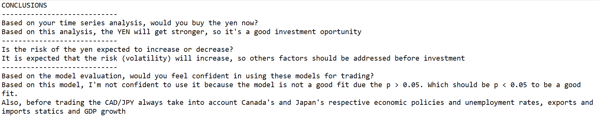
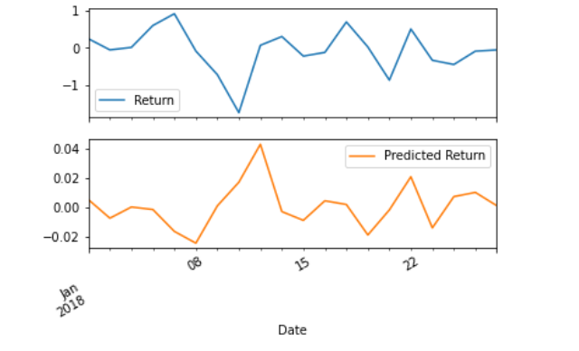
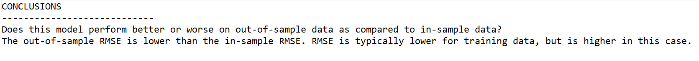

## 10-Time-Series-Homework

# Unit 10—A Yen for the Future

### Background
The financial departments of large companies often have to make foreign currency transactions when doing international business, while hedge funds are also interested in anything that will provide an edge in predicting currency movements. Hence, both are always eager to gain a better understanding of the future direction and risk of various currencies.

In this assignment, you will test the many time series tools that you have learned in order to predict future movements in the value of the Canadian dollar versus the Japanese yen.

You will gain proficiency in the following tasks:

1. Time series forecasting
2. Linear regression modelling

---

## Instructions

### Time-Series Forecasting

In this notebook, you will load historical CAD-JPY exchange rate data and apply time series analysis and modelling to determine if there is any predictable behaviour.

Follow the steps outlined in the time series starter notebook to complete the following:

1. Plotting the Settle price to check for long or short-term patterns.

* Do you see any patterns, long-term and/or short?

 *Answer: It is possible to see the average value of cad_jpy currency pair around 85, with the pattern being that the JPY getting stronger compared to CAD*

2. Decomposition using a Hodrick-Prescott filter (decompose the settle price into trend and noise).

* Do you see any patterns, long-term and/or short?

*Answer: The pattern is that the JPY is getting stronger compared to CAD*

3. Forecasting returns using an ARMA model.

* Based on the p-value, is the model a good fit?

*Answer: Based on the p-value, this model is not a good fit because the p value is more than 0.05. To be considered a good fit, p < 0.05.*

4. Forecasting the exchange rate price using an ARIMA model.

* What does the model forecast will happen to the Japanese Yen in the near term?

*Answer: The model forecast shows that the Japonese Yen will get stronger compared to CAD, it means that the Yen will increase in value*

5. Forecasting volatility with GARCH.

* What does the model forecast will happen to volatility in the near term?

*Answer: The model forecast shows that the volatility will increase in the near term*

Use the results of the completed time series analysis and modelling to answer the following questions:

### Linear Regression Forecasting
In this notebook, you will build a Scikit-Learn linear regression model to predict CAD/JPY returns with lagged CAD/JPY futures returns and categorical calendar seasonal effects (e.g., day-of-week or week-of-year seasonal effects).
Follow the steps outlined in the regression_analysis starter notebook to complete the following:

1. Data preparation (creating returns and lagged returns, and splitting the data into training and testing data)
2. Fitting a linear regression model.
3. Making predictions using the testing data.
4. Out-of-sample performance.
5. In-sample performance.

Use the results of the linear regression analysis and modelling to answer the following question:

Hints and Considerations

Out-of-sample data is data that the model hasn't seen before (testing data).
In-sample data is data that the model was trained on (training data).